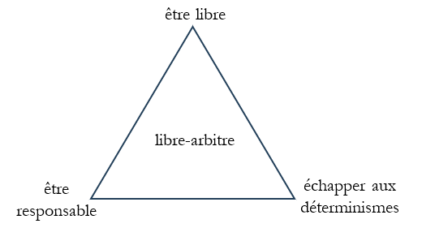

Nous pensons que notre culture est embourbée dans une confusion, dans un piège conceptuel, quelque chose qui nous empêche de penser correctement. Cette confusion, c’est l’idée de libre-arbitre. L’idée qu’il y a un problème du libre-arbitre. Nous voulons tuer le problème du libre-arbitre, pour de bon, qu’on ne se pose pas plus la question du libre-arbitre que l’on ne cherche à faire un mouvement perpétuel ou à purifier le plomb pour le changer en or[[1]](#_ftn1) : autant de projets mal conçus.

Le libre-arbitre – en tout cas la version qu’on veut tuer – c’est quoi ? C’est le triangle [être libre-être responsable-échapper aux déterminisme].

C’est lier entre elles ces trois idées. C’est penser que le fait d’être libre, en sorte à être responsable et qu’on puisse nous imputer nos actes – notamment nous accuser ou nous féliciter – a quelque chose à voir avec le fait d’échapper aux déterminismes – qu’on aurait pu ne pas le faire, que d’autres font ou feraient autrement, que c’était pas fatal… Et donc, par exemple, que si on cherche à tout expliquer, comme en socio, on va tout excuser, on va faire disparaitre les raisons de punir et d’accuser – *et que ça prouve que la socio a des limites* ! Ou quand on pense que puisqu’il y a des exceptions à une généralisation sociologique ( *tous les gens qui ont grandi dans la misère deviennent sont pas criminels !* ) ça veut dire qu’on peut échapper au déterminisme.

Nous soutenons que cette idée, ces idées, communes, sont incohérentes. C’est-à-dire que si on les creuse, on arrive à des impasses, à des trucs qui n’ont plus de sens, et qu’on se sort généralement de ces impasses en haussant les épaules. Et nous soutenons que ces idées sont  *graves* , que ce n’est pas une question métaphysique subtile. L’embourbement conceptuel nous empêche d’aller au bout des raisonnements, il nous empêche de comprendre ce qu’il se passe, il fait accuser la sociologie, il rend la connaissance condamnable. Il nous fait croire que l’enfer est justifié, et que la culpabilité a un fondement métaphysique. Il faut en finir avec le libre-arbitre, tourner cette page civilisationnelle moisie.

Nous ne sommes pas du tout les premiers à voir ce qui cloche. En fait la majorité de la communauté philosophique est plus ou moins d’accord sur le fond. Mais c’est pas le problème. Car le domaine demeure académique, ésotérique, on chipote sur des subtilités de vocabulaire ou d’implications conceptuelles. Il y en a même qui pensent qu’il ne faut pas révéler le secret à la populace, que le libre-arbitre joue un rôle social précieux. Nous refusons cet obscurantisme de principe. Nous pensons qu’il y a un combat à mener. L’idée du libre-arbitre est ancrée dans les réflexes, les représentations, les discours, elle a des millénaires d’avance. Ce n’est pas un groupe de philosophes, sans doute, qui peuvent la vaincre dans la conscience commune, mais cela ne veut pas dire que l’effort de guerre est vain. Nous voulons amener l’absurdité du libre-arbitre à l’évidence. Donner des armes pour se protéger contre ses sophismes. Pour cela, il nous faut être exacts, fermes, et populaires.

---

[[1]](#_ftnref1) C’est-à-dire que s’il y en a qui persistent, on se moque d’eux et on les considère à raison comme un peu confus.
